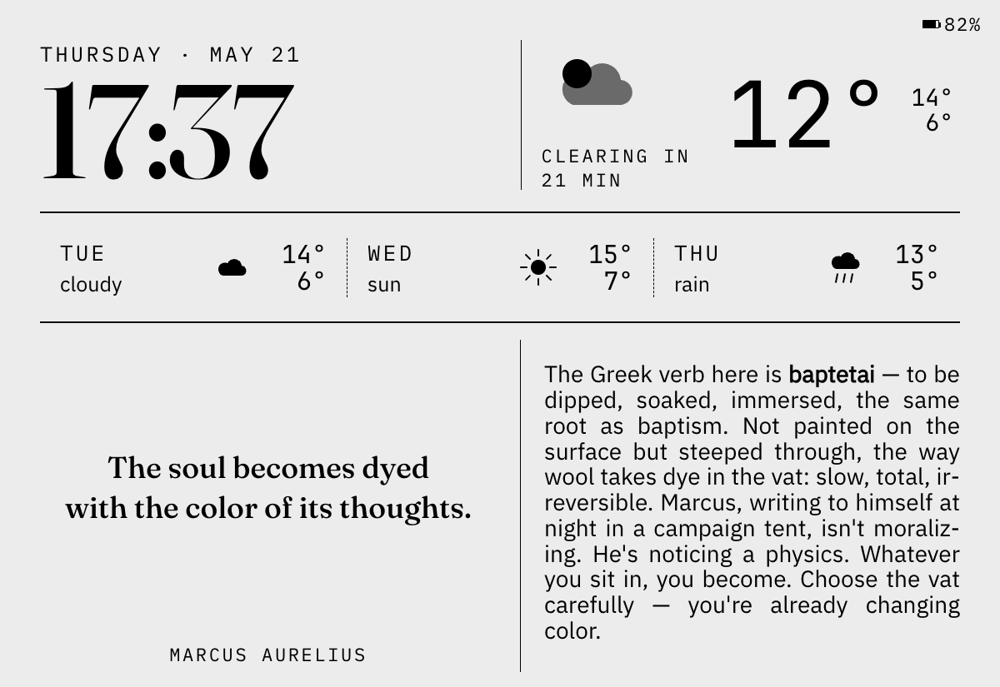
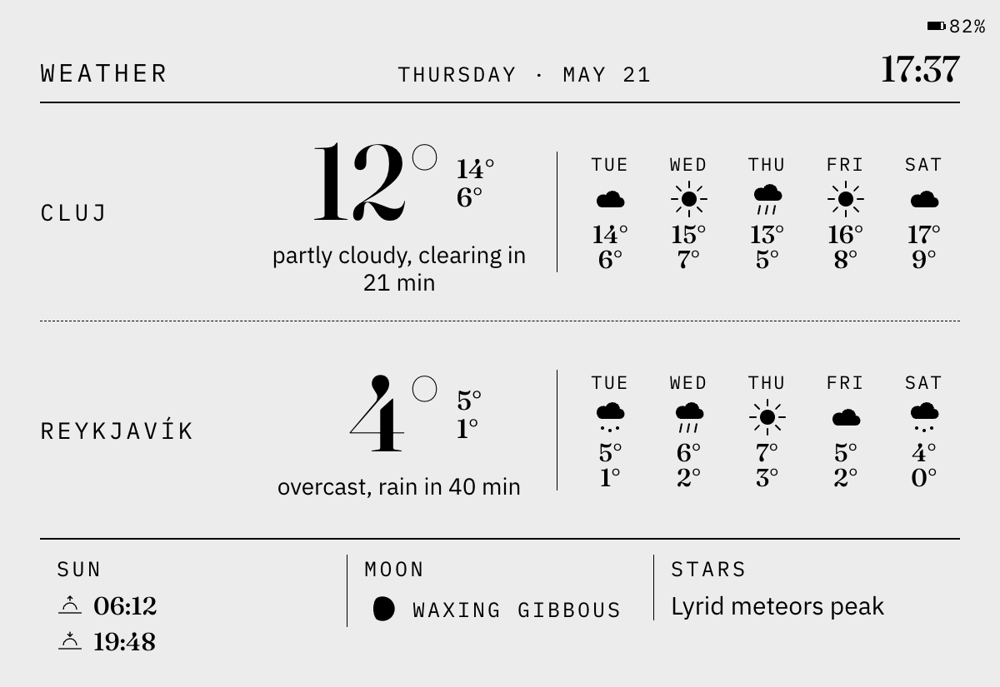

# Inkplate

A literary kitchen-fridge dashboard on an Inkplate 10 e-ink panel. Each day picks a curated *triplet* — anchor text, summary delight, gallery image — and rotates the active face through the day via a per-tier 3:1 main:weather schedule (Summary or Gallery shows three times, then Weather once, repeating). A Sonos integration takes over while music plays; a tap on the panel transiently flips to the counterpart face. Battery-powered, ~3 months between charges.


## What it does

The panel cycles through five views over the course of a day, each typeset in newspaper-grade serifs and printed in 8-shade greyscale on e-ink:

- **Morning.** A giant Didone clock, the weather at a glance, and a small literary delight — a short poem, aphorism, or fragment — paired with a 400-character "smart pill": a gloss on one word from the text above. An etymology, a translator's note, the cultural ripple behind a phrase. Something worth a sip of attention with the morning coffee.
- **Daytime.** The day's curated artwork takes over: some days a photograph, some days a hand-typeset poem, always with title and attribution. About a thousand of these are queued and one surfaces each day at 06:00 — same view all day, so it has time to settle in the room.
- **Weather, on the off-beat.** A slower look at conditions: two locations (home, and somewhere else you care about), five-day forecast, sunrise and sunset, the current moon phase, and whatever astronomical event is happening that week. Rotates in throughout the day so you check it without thinking about it.
- **Night.** The panel goes quiet. A natural-language clock ("quarter to ten"), the weekday, the night's weather in three words, and a moonlit woodblock print on the right.
- **Now-Playing.** Whenever music starts on the kitchen speaker, the panel automatically switches to album art and track info. Classical recordings get a different layout — composer on top, work title in the big slot, performers listed by instrument — while pop tracks keep the familiar artist / title / album / year stack.

Tap the frame to flip between the day's current view and the weather; a small dot near the battery icon confirms the tap before the next image actually paints, so you know it registered. The battery lasts about three months between charges, the clock updates every minute without going on WiFi, and the daily rotation runs at 06:00 each morning — so you wake up to a fresh view.

## Faces

All faces rendered at the panel's native 1200 × 825 from the project's test pipeline. Battery / clocks reflect the fixture values, not real time. Regen with `scripts/build-showcase.sh` (spins a separate test renderer on port 8585 so it doesn't disturb the live device).

<table>
<tr><th width="50%">Summary (morning main)</th><th width="50%">Weather (alternates in every tier)</th></tr>
<tr>
<td width="50%"></td>
<td width="50%"></td>
</tr>
<tr>
<td width="50%">Giant Didone clock, current conditions with an immediate-horizon nowcast ("CLEARING IN 21 MIN"), 3-day forecast strip, and the delight pair: a 2-line Marcus Aurelius aphorism on the left, and on the right a smart pill that etymologises the Greek <em>baptetai</em> (the root behind "dyed" in the aphorism — and the same root as "baptism"). The smart pill is curated alongside the companion text in the same triplet sidecar, so the gloss is always bound to a word in the text above.</td>
<td width="50%">Two-location current conditions (here: Cluj + Reykjavík fixtures) with per-location nowcast lines ("clearing in 21 min", "rain in 40 min") sourced from the OpenWeatherMap minutely feed, per-location 5-day forecast, sun/moon, plus an astronomy "what's happening this week" cell.</td>
</tr>
</table>

| Night |
|---|
|  |
| Italic Fraunces fuzzy-time clock ("quarter to five") on the left with weekday + weather strip; on the right, a portrait nocturne — here Hiroshige's *Moon Pine at Ueno* (1857, *One Hundred Famous Views of Edo*) framing the full moon through the curved pine. The quarter-hour ticks refresh partially (offline) via baked phrase bitmaps. |

### Gallery — three layout variants

The Gallery face dispatches between a text layout and image layouts based on the day's slot. The image layout is picked from the source aspect ratio: `gv-native` (panel-aspect ~1.35–1.70, full-bleed with a thin caption strip), and a **split layout** for portrait images (image on the left at its natural aspect ratio, caption on the right). A `gv-square` matted-pillarbox layout also exists for near-square images; it's a corner case in the curated pool so it's not shown here.

<table>
<tr><th width="50%">Text (typeset poem / aphorism / fragment)</th><th width="50%">Visual — landscape (<code>gv-native</code>, full-bleed)</th></tr>
<tr>
<td width="50%"></td>
<td width="50%"></td>
</tr>
<tr>
<td width="50%">Bashō's old-pond haiku in haiku-form CSS. The renderer picks one of six form layouts (haiku, sonnet, free-verse, aphorism, quote, fragment) by the sidecar's <code>form:</code> field.</td>
<td width="50%">Charles Marville's <em>Rue de Constantine, Paris</em> (1866), AR 1.35 — sits in the panel's native band, drawn full-bleed with a thin caption strip below.</td>
</tr>
</table>

| Visual — portrait (split layout) |
|---|
|  |
| Dorothea Lange's *Migrant Mother* (FSA, 1936), AR 0.77 — image holds the left column at its natural aspect ratio; title + attribution flow on the right. |

### Now-Playing — two layout variants

Sonos override. When a track is playing the renderer enriches Spotify track ids via MusicBrainz; classical recordings get a composer-anchored layout (work / movement / performers with role chips), everything else falls back to artist / title / album / year. Album art is fetched from the HA media-player proxy at render time; if the lookup fails the renderer falls back to a stock "NOW PLAYING" plinth.

<table>
<tr><th width="50%">Classical (composer-anchored)</th><th width="50%">Rock / pop (artist-anchored)</th></tr>
<tr>
<td width="50%"></td>
<td width="50%"></td>
</tr>
<tr>
<td width="50%">Górecki's Symphony No. 3 (Symphony of Sorrowful Songs), first movement, Dawn Upshaw (soprano) / London Sinfonietta / David Zinman, Nonesuch 1992. Composer in caps on top, work title in the big slot, movement subtitle in italic, performers with role chips below.</td>
<td width="50%">David Bowie, <em>Heroes</em> (RCA, 1977). Same template, different field routing: artist in caps, track title in the big slot, album row underneath, year on its own line.</td>
</tr>
</table>

## Hardware

The panel, accelerometer, and battery were all bought from [soldered.com](https://soldered.com) (the Inkplate manufacturer). The IMU breakout plugs into the Inkplate's onboard easyC / Qwiic connector for I²C, the battery into the JST-PH socket — but **one extra wire has to be soldered by hand** to make tap-to-wake work. See [Build](#build) below.

| Part | Notes |
|---|---|
| **[Inkplate 10](https://soldered.com/products/inkplate-10)** (Soldered) | 9.7″ e-ink, 1200 × 825, 3-bit greyscale (8 shades), no hue. Custom HAL wraps Soldered's library. |
| ESP32-WROVER (built into Inkplate 10) | PSRAM required for 3-bit framebuffer + image decode. |
| **[LSM6DSO 6-DoF IMU breakout](https://soldered.com/product/accelerometer-gyroscope-lsm6dso-6-dof-breakout/)** (Soldered easyC) | I²C 0x6B over easyC for register access; **INT1 manually soldered to GPIO 36** (the SW3 wake-button net) for ext0 deep-sleep wake on tap. See [Build](#build). |
| **[5000 mAh Li-ion battery](https://soldered.com/product/li-ion-battery-5000mah-3-7v/)** (Soldered, JST-PH) | ~3 months between charges depending on tier cadence. |
| **[IKEA RÖDALM frame](https://www.ikea.com/us/en/p/roedalm-frame-birch-effect-20548895/)** | RÖDALM is a shadow-box frame whose acrylic front can sit flush at the front, leaving the full inner depth empty behind it. The Inkplate PCB + 5000 mAh battery fit behind the panel cleanly. Tap-coupling mount for the LSM6DSO: glue a toothpick to the back of the breakout and tape the toothpick to the inner frame surface — the rigid wooden lever transmits a finger tap on the frame straight into the IMU without damping. The 12×16″ (~30×40 cm) size matches the Inkplate 10's 9.7″ active area with comfortable margin; smaller RÖDALM sizes will not fit. |
| Mac (always-on) | Hosts the Node renderer (Playwright + Chromium) and runs the daily pairing script. |
| HAOS VM (e.g. Synology, Pi) | Home Assistant + Mosquitto broker + the Advanced SSH add-on. |

## Home Assistant

The kitchen-side brain runs on Home Assistant. A HAOS install (recommended) needs two add-ons and a handful of HA-side integrations beyond what this repo deploys; everything project-specific gets rsynced into `/config/custom/inkplate/` by `make deploy-ha`.

**Required HAOS add-ons** (Settings → Add-ons):

| Add-on | Why |
|---|---|
| **Mosquitto broker** | MQTT broker. The device firmware publishes state to `inkplate/state/*` and subscribes to `inkplate/command/*`; HA sits in the middle. |
| **Advanced SSH & Web Terminal** | Deploy path. `make deploy-ha` rsyncs into `/config/custom/inkplate/` over SSH and triggers `ha core check && ha core restart`. |

**Required HA integrations** (Settings → Devices & Services → Add Integration):

| Integration | What it powers |
|---|---|
| **MQTT** (Mosquitto) | Device wake / state / command channel. |
| **Sonos** | The Now-Playing face. The renderer reads the active `media_player.<your_sonos>` entity and enriches Spotify tracks via MusicBrainz before laying them out. |
| **Open-Meteo** | Current conditions and 5-day forecast for both weather locations. Primary weather source. |
| **OpenWeatherMap (One Call 3.0)** | Minutely-resolution nowcast ("clearing in 21 min", "rain in 40 min"). Free tier covers ~1k calls/day, well within budget. Optional — if absent, the nowcast line is omitted. |
| **Home Assistant Companion app** *(optional)* | Battery-low and motion alerts via `notify.mobile_app_*`. The deploy aliases this behind `notify.inkplate_operator` so renames don't break automations. |

**External API keys** (set in `ha/secrets.yaml`, template at `ha/secrets.yaml.example`):

- **OpenWeatherMap** — for the One Call 3.0 minutely subscription.
- **Spotify Client ID + Secret** — Client Credentials flow only, no scopes. Powers the now-playing classical-vs-pop layout enrichment via MusicBrainz lookups keyed off Spotify track ids.
- **MusicBrainz User-Agent string** — no key, but their politeness policy requires identifying contact info (e.g. `your-project/0.1 ( you@example.com )`).
- **Home Assistant long-lived access token** — lets the renderer fetch Sonos `entity_picture` URLs via the HA media-player proxy.
- *(Optional)* **Anthropic API key** — only used by offline corpus tooling (`ha/scripts/generate_astro_event.py`, ad-hoc corpus enrichment). Not used at runtime.

**What this repo deploys into HA** (`ha/` directory, rsynced to `/config/custom/inkplate/`):

- **Automations** — face rotation, Sonos override, gesture handling, wake-schedule republisher, weather / clock / sonos publishers to the renderer.
- **Sensors** — astronomy events, weather buckets, forecast templates.
- **Integration packages** — MQTT topic config, weather sensors, REST commands targeting the renderer.
- **Helpers** — `input_text` / `input_boolean` / `input_number` / `input_datetime` for active-override state, alternation phase, schedule hash, etc.
- **Scripts** — poetic-line picker, astro event generator.
- **Config** — `wake_schedule.yaml`, `night_poetic_pool.yaml`, `now_playing_sources.yaml`, all operator-editable.

Full installation walkthrough in [`SETUP.md`](SETUP.md); HA-side deep-dive in [`ha/README.md`](ha/README.md).

## Build

Two physical steps go beyond plug-in assembly: a single solder joint to wire the IMU's tap interrupt into a GPIO the ESP32 can wake on, and a small mechanical detail that lets a finger tap on the frame actually reach the accelerometer.

### 1. Solder the IMU INT1 pin to GPIO 36

**What:** run a thin wire from the **INT1** pad on the [LSM6DSO breakout](https://soldered.com/product/accelerometer-gyroscope-lsm6dso-6-dof-breakout/) to the inboard side of the **SW3** wake-button footprint on the Inkplate 10 PCB (that net is ESP32 **GPIO 36**, with the on-board R41 pull-up to 3V3). Pinout reference: Soldered's [Inkplate 10 free GPIO](https://oldshop.soldered.com/documentation/inkplate/10/hardware/free-gpio/) page lists the GPIOs exposed on the board and which are usable for external interrupts.

**Why this can't be skipped:** the easyC / Qwiic connector carries only `SDA`, `SCL`, `3V3`, `GND` — fine for reading and writing the LSM6DSO's registers over I²C, but the chip's tap-detection *interrupt output* (INT1) isn't on that bus. The ESP32 in deep sleep can't poll I²C; it can only wake on a physical level change on a designated GPIO (`esp_sleep_enable_ext0_wakeup`). Without an INT1 → GPIO wire, every tap would have to wait for the next scheduled timer wake to be noticed — minutes of latency, defeating the whole point.

**Why GPIO 36 specifically:** the Inkplate already wires GPIO 36 to its SW3 wake-button net, complete with the R41 pull-up to 3V3. Reusing that net means no new pull-up resistor, no extra GPIO, and the button still works in parallel — both the button and the IMU's INT1 pulse the same line LOW; the firmware reads `WAKE_UP_SRC` after each ext0 wake to disambiguate. In the sealed-frame build the button is unreachable, so practically every IO36 LOW originates from a tap.

**Firmware handling.** For two devices to share the line cleanly, INT1 has to be configured **open-drain, active-low, pulsed** (`CTRL3_C[PP_OD]=1`, `CTRL3_C[H_LACTIVE]=1`, non-latched). The firmware sets this up in `firmware/src/hal/real/RealIMU.cpp` at boot — no manual register pokes needed. Open-drain means INT1 sinks LOW or floats high-Z but never drives HIGH, so it can't fight R41 or the wake-button switch.

Full register-level details and a probe tool (`firmware/src/tap_probe.cpp`) for verifying the solder joint after assembly live in [`firmware/docs/gestures.md`](firmware/docs/gestures.md) under "Wiring."

### 2. Mechanical tap-coupling mount

The LSM6DSO's tap classifier needs a real shock event on its Z axis. The chip's minimum threshold (62.5 mg, set in `kTapThreshold`) is already the floor — there is no "more sensitive" — so the build instead reduces the mechanical impedance between a finger and the chip:

- Glue a wooden **toothpick** to the back of the LSM6DSO breakout (so its long axis sticks out perpendicular to the PCB).
- Tape the toothpick to the inner wood surface of the RÖDALM frame.

The rigid toothpick acts as a lever: a finger tap on the front of the frame transmits a clean impulse through the wood and the toothpick straight into the breakout, instead of being absorbed by mounting foam or wire-ties. The resulting waveform is amplitude-clean enough for the LSM6DSO's slope-HPF to discriminate from ambient kitchen vibration (refrigerator compressor cycles, door slams), and the firmware's spurious-wake guard catches the remainder.

### 3. Sanity-check the build

After step 1, before sealing the frame:

```sh
cd firmware
pio run -e inkplate10 --target upload -t monitor    # flash + tail serial
# When prompted, switch the firmware build target to tap_probe in
# platformio.ini and re-upload. The probe prints TAP_SRC on every
# falling edge of GPIO 36 — a clean tap shows SINGLE_TAP or DOUBLE_TAP
# bits set within ~10 ms of finger contact.
```

If the probe sees the GPIO 36 line go LOW but `TAP_SRC=0x00`, the wire is on the right net but the LSM6DSO didn't latch the event — usually a sign the solder joint is on the wrong pad of the breakout, or the breakout's INT1 polarity is still default push-pull (config error, fixable in firmware) rather than open-drain.

## Architecture (10,000 ft)

```
                 ┌─────────────┐
   corpus/  ──▶  │   pairing   │  ──▶  renderer/inputs/{pairing,smart_pill}.json
  (YAML +        │  (Python,   │       + companion.jpg, gallery.jpg, nocturne.jpg
   binaries)     │   06:00)    │
                 └─────────────┘
                       │ (one triplet/day)
                       ▼
   HA  ──┬─▶  publishers  ──▶  renderer/inputs/*.json (clock, weather, sonos, climate, device)
         ├─▶  schedule tick (every 15 m, picks face via per-tier 3:1 main:weather)
         ├─▶  wake-schedule pusher (ha/config/wake_schedule.yaml → retained MQTT)
         └─▶  gesture handler (tap → flip displayed face transiently; first-wake / peek during now-playing)
                       │
                       ▼  publishes inkplate/command/active_mode (retained MQTT)
                       │
                 ┌────────────┐
                 │   device   │  ◀── PNG fetch ──▶ renderer (Mac, port 8575)
                 │ (Inkplate) │      Playwright → Chromium → 1200×825 8-bit greyscale PNG
                 └────────────┘
                  │       ▲
                  ▼       │
           heartbeat   tap → IMU INT1
        inkplate/state/*    └─▶ ack glyph + gesture publish
```

The **renderer** is the only stateful service of consequence. It accepts JSON pushes from HA at `POST /inputs/:name`, reads them on each `GET /display/:mode.png` request, runs templates through Playwright/Chromium, and returns an 8-bit greyscale PNG (the device handles palette dithering itself). It also exposes `/display/:mode/clock-zone.json` so the firmware can pin its 1-bit partial-update digits at the same pixels the Full painted.

The **device firmware** is mostly pure-logic over a HAL interface. Every wake (timer, IMU tap, cold-boot) reads the schedule planner in `firmware/include/wake.h` to decide Full / Partial / Poll / Skip. Partials offline-render the clock zone at the device's RTC time; Fulls fetch a fresh PNG over WiFi.

A deeper diagram + data-flow walkthrough is in [`ARCHITECTURE.md`](ARCHITECTURE.md).

## Repo layout

```
inkplate/
├── README.md         ← you are here
├── ARCHITECTURE.md   ← system diagram, data flow, design decisions
├── SETUP.md          ← operator quick-start (corpus → renderer → HA → device)
├── CLAUDE.md         ← repo conventions for AI / human contributors
│
├── corpus/           Curated images + texts (sidecar YAML; binaries off-tree)
├── pairing/          Python: corpus validator, daily triplet picker, ingestion CLI
├── renderer/         Node + Playwright: HTML templates → 1200×825 PNGs
├── ha/               Home Assistant config: automations, sensors, integrations
├── firmware/         Inkplate 10 firmware (PlatformIO + custom HAL) + host simulator
└── openspec/         Specs (ratified) + change proposals (in-flight) + archive
```

Each area has its own `README.md` and (most) a `docs/` with deeper guides:

- [`corpus/README.md`](corpus/README.md) — sidecar schema, rights tiers, manifest
- [`pairing/README.md`](pairing/README.md) — CLI reference, ingestion workflow
- [`renderer/README.md`](renderer/README.md) — endpoints, template structure, Playwright setup
- [`ha/README.md`](ha/README.md) — deployment, override state machine, troubleshooting
- [`firmware/README.md`](firmware/README.md) — wake schedule, partial-refresh clock, tap handling, host simulator

## Quick-start

For a clean install across all four hosts, follow [`SETUP.md`](SETUP.md). The TL;DR per area:

```sh
# Renderer (on the Mac that drives the device)
cd renderer && npm install && npm start                      # serves on :8575

# HA config (deploys to your HAOS VM over SSH)
make deploy-ha                                               # rsync + ha core restart

# Firmware (with Inkplate 10 plugged into USB)
cd firmware && pio run -e inkplate10 --target upload

# Pairing tooling
pip install -e pairing                                       # adds the `corpus` CLI
corpus validate                                              # sanity-check the corpus
```

## Status

Working in single-installation production, but the project is opinionated and not yet a turnkey kit:

- **Corpus**: 1,023 triplets across the personal/PD library; the curator's taste is baked in. You can swap your own corpus, but the taxonomy and rights tiers are project-specific.
- **Hardware**: Inkplate 10 only. The HAL abstraction (`firmware/include/hal/`) is clean enough that another e-ink board could be added, but no other targets exist.
- **HA bias**: deploy assumes HAOS VM with the Advanced SSH add-on. Bare-metal Home Assistant or HA Container would need [`ha/deploy.sh`](ha/deploy.sh) tweaks.
- **OpenSpec**: most originally-planned features have shipped; some specs are stale (the code is the source of truth — see archived changes in [`openspec/archive/`](openspec/archive/)).

What works end-to-end as of this writing:

- Daily triplet rotation, Summary / Weather / Gallery (visual + text) / Night / Now-Playing faces.
- Per-tier 3:1 main:weather alternation in HA; both tap kinds drive the same intent (transient flip of the displayed face during schedule; first-wake or peek during Now-Playing).
- Partial-refresh clock zone every minute (offline) on Summary / Weather / Gallery (split + landscape) / Now-Playing / Gallery-Text, and every 15 min on Night via the baked fuzzy-time phrase set.
- Sonos override with classical-vs-pop enrichment via Spotify+MusicBrainz, edition-suffix stripping, paused-music linger, per-minute Poll cadence during a session for ~60 s track-change latency.
- Operator-pushable wake schedule; firmware diag includes EPD power-good, WiFi RSSI, schedule hash, reset reason.
- Post-OTA recovery, IMU tap detection on the toothpick-and-tape frame mount (with separate `gesture_response` event channel for the in-flight grace window), NTP resync, listen-with-retry on the renderer, EADDRINUSE crash-loop guard.

Known limitations:

- Renderer is a single point of failure (Mac sleeping = panel doesn't update). Move to a Pi if uptime matters.
- Battery percentage formula caps at 4.15 V → 100 %, so the meter sits at "100 %" for the first ~10 % of discharge. Cosmetic, not functional.
- Single-tap and double-tap are unified in HA (the toothpick-and-tape mount can ring as either depending on tap force; treating them the same eliminates "tap didn't register" cases). If you want them distinct, undo `ha/automations/gesture_override.yaml`.

## Contributing

This is a personal project, but the architecture is generic enough to fork. For a tour of the codebase before editing, start with [`CLAUDE.md`](CLAUDE.md) (which defines repo conventions and OpenSpec governance), then the area-specific READMEs. PRs welcome but not actively solicited.

## License

MIT — see [`LICENSE`](LICENSE). Third-party libraries (Playwright, Hono, Soldered Inkplate, paho-mqtt, etc.) retain their own licenses — see each area's package manifest.

The `corpus/` directory is **not** covered by this license. Sidecar templates and tooling under `corpus/` are MIT; any actual corpus content (operator-curated images, texts, smart-pill bodies) is gitignored and belongs to its original rights-holders — see `openspec/specs/corpus-schema` for the rights-tier rules each fork must abide by.
